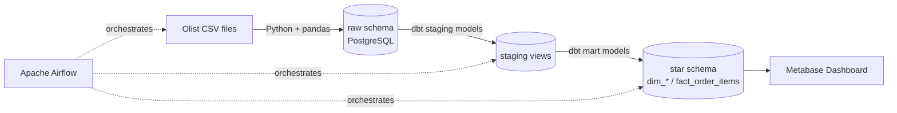
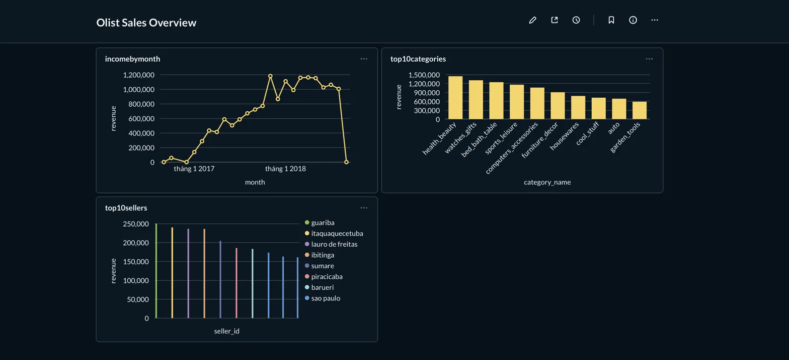

# Olist E-commerce ETL Pipeline

An end-to-end batch ETL pipeline built with **Docker, Apache Airflow, dbt, and PostgreSQL**, transforming raw Brazilian e-commerce data into a star-schema data warehouse and a BI dashboard.

## Architecture



**Pipeline flow:** `extract_load` (Python/pandas → raw Postgres) → `dbt_run` (staging → star schema) → `dbt_test` (data quality checks), all orchestrated daily by an Airflow DAG.

## Tech stack

| Layer | Tool |
|---|---|
| Orchestration | Apache Airflow 2.9 |
| Transformation | dbt (dbt-oss / Fusion engine) |
| Storage | PostgreSQL 16 |
| Extract & Load | Python, pandas, SQLAlchemy |
| BI / Visualization | Metabase |
| Environment | Docker Compose |

## Data model (star schema)

- **`fact_order_items`** — grain: 1 row per product per order
- **`dim_customers`**, **`dim_products`**, **`dim_sellers`**, **`dim_date`**

13 dbt tests cover uniqueness, not-null, and referential integrity between the fact table and its dimensions.

## Dashboard



Revenue trend by month, top product categories, and top sellers by city — built in Metabase on top of the star schema.

> **Data note:** the source dataset (Olist, public on Kaggle) has incomplete order data for its final month, which shows up as a sharp drop at the end of the revenue trend — a known characteristic of the raw data, not a pipeline issue.

## Running it locally

```bash
git clone https://github.com/btdat110/olist-etl-pipeline.git
cd olist-etl-pipeline
mkdir -p data

# 1. Download the Olist dataset from Kaggle and place the 7 CSVs in data/
#    https://www.kaggle.com/datasets/olistbr/brazilian-ecommerce

# 2. Build and start everything
docker compose build
docker compose up -d

# 3. Airflow UI: http://localhost:8080 (admin/admin)
#    Trigger the "olist_etl_pipeline" DAG

# 4. Metabase: http://localhost:3000
#    Connect to host "dw-postgres", db "datawarehouse", user "dwuser"
```

## Project structure

```
├── dags/etl_dag.py              # Airflow DAG: extract -> dbt run -> dbt test
├── scripts/extract_load.py      # Extract & Load step
├── dbt_project/
│   ├── models/staging/           # 1:1 cleaned views over raw tables
│   └── models/marts/             # star schema (dims + fact) + tests
├── docker-compose.yml
└── Dockerfile                    # Airflow image + pandas/dbt/psycopg2
```

## Key challenges solved

- **Dependency conflicts** between Airflow's pinned SQLAlchemy version and the dbt adapter — resolved using Airflow's official pip constraints file.
- **dbt Fusion engine compatibility** — the Postgres adapter required the `DBT_ALLOW_EXPERIMENTAL_ADAPTERS` flag, and generic test syntax needed migrating to the new `arguments`-based format.
- **Idempotent reloads** — the extract step uses `DROP TABLE ... CASCADE` before reloading raw tables, since downstream dbt views/tables depend on them and a naive `replace` fails on rerun.
